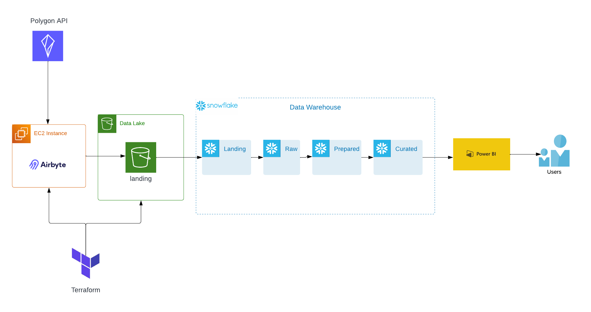

# stock-market-analysis

This project is part of the "Proyecto Aplicado en Analítica de Datos" course at the University of Los Andes.

## Context

The Stanley Group is one of the most relevant financial conglomerates in Latin America. It presents two main strategic visions, the first is the management of innovation in financial products, and the second is the Money Desk, which is more related to capital market products and has a greater impact on the financial performance of the group, as its current loss situation is around $7 million USD, while for the former, its losses are close to $250 thousand USD.

Among the main financial services managed by the Money Desk are equity investments, asset management, portfolio management, mergers and acquisitions. Regarding performance measures associated with the project, the financial performance of the group (gross margin and profitability), customer satisfaction (positive ratings vs. total ratings), and the turnover rate of human talent should be taken into account, which is related to additional costs due to its management and maintenance.

## Data

The data for this project will be obtained by making daily calls to the Polygon API. The API documentation can be found at: [https://polygon.io/docs/stocks/getting-started](https://polygon.io/docs/stocks/getting-started).

For this project, we will be taking data from the top 15 companies that are part of the S&P500 index. This will include the following stock symbols:

- AAPL (Apple Inc.)
- MSFT (Microsoft Corporation)
- AMZN (Amazon.com, Inc.)
- META (Meta Platforms, Inc.)
- GOOGL (Alphabet Inc. Class A)
- GOOG (Alphabet Inc. Class C)
- TSLA (Tesla, Inc.)
- JPM (JPMorgan Chase & Co.)
- JNJ (Johnson & Johnson)
- BRK.B (Berkshire Hathaway Inc. Class B)
- V (Visa Inc.)
- PG (Procter & Gamble Company)
- NVDA (NVIDIA Corporation)
- UNH (UnitedHealth Group Incorporated)
- XOM (Exxon)

This data will be used to analyze the performance of these companies in the stock market and to predict possible future trends.

## Architecture

The architecture for this project involves defining AWS resources through Infrastructure As Code using Terraform. AWS EC2 servers are deployed to make calls to the Polygon API through Airbyte. The data is then stored in an AWS S3 data lake before being passed to a data warehouse in Snowflake where it is transformed into RAW, PREPARED, and CURATED schemas for serving to end-users on a PowerBI dashboard.

This architecture was chosen for its ability to handle large amounts of data and for its scalability. Defining resources through Infrastructure As Code with Terraform allows for efficient management and deployment of resources in a reproducible and scalable way. AWS EC2 servers provide a reliable and cost-effective way to make API calls, while Airbyte allows for seamless data integration from multiple sources. Storing the data in an AWS S3 data lake allows for easy access and retrieval of the data, while Snowflake provides a powerful data warehousing solution with support for multiple data types and seamless integration with other AWS services. Finally, the data is transformed for optimized performance and efficient querying. The PowerBI dashboard provides a user-friendly interface for end-users to interact with the data and gain insights.

## Analysis

Description of the analysis performed on the data.

## Results

Summary of the results obtained from the analysis.

## Conclusion

Conclusions drawn from the results and any further recommendations.
